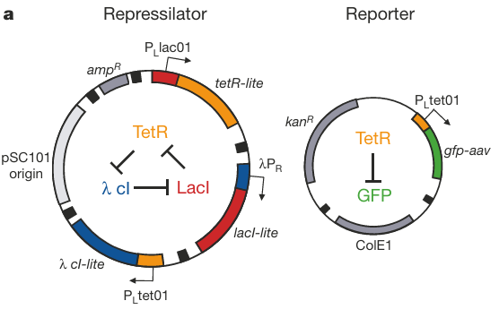
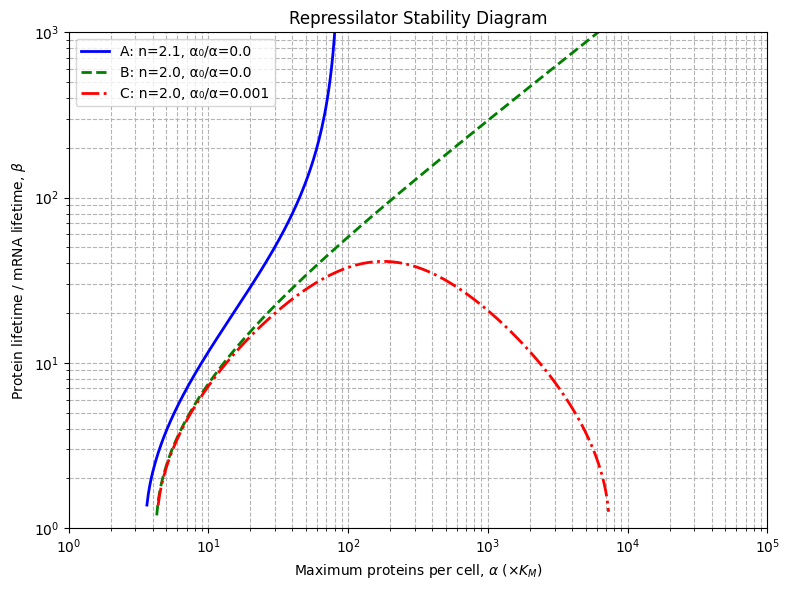
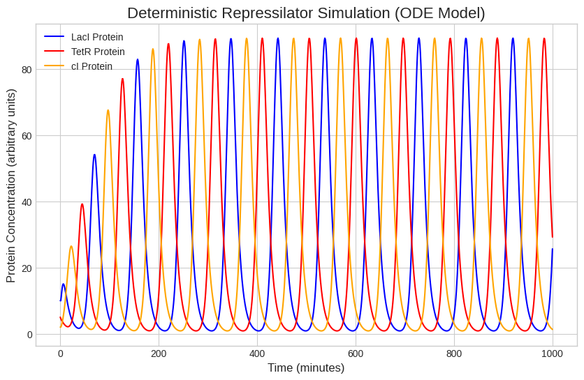
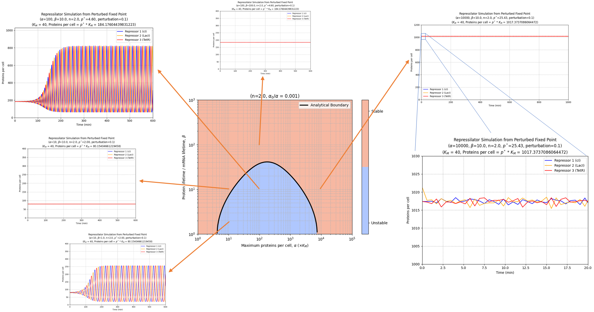

# Mathematical Modeling & Simulation of the Repressilator

## Overview
This repository contains the numerical simulation and mathematical analysis of the **Repressilator**, a synthetic oscillatory network of transcriptional regulators. The model explores the dynamics of a genetic circuit consisting of three repressor proteins (LacI, TetR, and CI) arranged in a cyclic inhibitory feedback loop.

*Figure 1: Schematic of the Repressilator synthetic genetic circuit showing the cyclic inhibitory feedback loop between lacI, tetR, and cI genes.*

## Background
The repressilator was originally designed and implemented in *Escherichia coli* by Elowitz and Leibler (2000). By utilizing a negative feedback loop with an odd number of components, the system avoids stable steady states under certain parameter regimes, leading to sustained oscillations in protein concentration. This project mathematically proves the conditions for these oscillations and simulates them using Python.

## The Mathematical Model

The network is modeled using a system of six coupled ordinary differential equations (ODEs)—three for mRNA transcripts ($m_i$) and three for their corresponding proteins ($p_i$).

### mRNA & Protein Dynamics
$$\frac{dm_i}{dt} = -m_i + \frac{\alpha}{1 + p_j^n} + \alpha_0$$

$$\frac{dp_i}{dt} = -\beta(p_i - m_i)$$

Where:
* $i \in \{lacI, tetR, cI\}$ and $j$ is the preceding repressor ($j=cI$ for $i=lacI$, etc.).
* $\alpha$: Maximum transcription rate.
* $\alpha_0$: Basal leakiness of the promoter.
* $\beta$: Ratio of protein decay rate to mRNA decay rate.
* $n$: Hill coefficient (cooperativity of repressor binding).

## Linear Stability Analysis

At steady state, the derivatives are zero ($\frac{dm_i}{dt} = \frac{dp_i}{dt} = 0$). Assuming symmetry across the three genes, we get $m_i^* = m^*$ and $p_i^* = p^*$. 

The stability of this steady state is determined by the $6 \times 6$ Jacobian matrix:

$$
J = \begin{bmatrix}
-1 & 0 & 0 & 0 & 0 & f' \\
0 & -1 & 0 & f' & 0 & 0 \\
0 & 0 & -1 & 0 & f' & 0 \\
\beta & 0 & 0 & -\beta & 0 & 0 \\
0 & \beta & 0 & 0 & -\beta & 0 \\
0 & 0 & \beta & 0 & 0 & -\beta
\end{bmatrix}
$$

Here, $f'$ represents the derivative of the repression function evaluated at the steady state ($p^\ast$).

$$
f' = \frac{-\alpha n (p^\ast)^{n-1}}{(1 + (p^\ast)^n)^2}
$$

To simplify the analysis, this $6 \times 6$ matrix can be transformed using the cube roots of unity ($\lambda_k$) into three independent $2 \times 2$ block matrices ($J_k$) for each mode $k \in \{0, 1, 2\}$:

$$
J_k = \begin{bmatrix}
-1 & f'\lambda_k \\
\beta & -\beta
\end{bmatrix}
$$

By evaluating the eigenvalues of $J_k$, we can determine the stability conditions. The complex eigenvalues that arise in modes 1 and 2 cross the imaginary axis as parameters $\alpha$ or $n$ increase, indicating a **Hopf bifurcation** and the onset of sustained limit-cycle oscillations.

## Simulation Results

The Jupyter Notebook (`repressilator_simulation.ipynb`) included in this repository numerically integrates the ODEs to visualize these dynamics. 

### 1. 2-Parameter Stability Boundary
By mapping the boundaries where the eigenvalues cross the imaginary axis, we can visualize the parameter space ($\alpha$ vs $\beta$) where the system becomes unstable and begins to oscillate.

*Figure 2: Stability boundaries for the repressilator across different Hill coefficients ($n$) and leakiness ratios. The system exhibits sustained oscillations within the unstable parameter regimes.*

### 2. Time Series Simulation
When parameters are chosen within the unstable regime, numerical integration reveals the characteristic out-of-phase oscillations of the three repressor proteins.

*Figure 3: Numerical simulation of protein concentrations over time, demonstrating sustained limit-cycle oscillations.*

### 3. Bifurcation Diagram
Treating the maximum transcription rate ($\alpha$) as our control parameter reveals the exact onset of the Hopf bifurcation. The diagram plots local extrema (maxima and minima) of the protein concentration, splitting into upper and lower branches when oscillations begin.

*Figure 4: Bifurcation diagram showing the transition from a stable fixed point to sustained oscillations as $\alpha$ increases.*

## Repository Structure
* `repressilator_stability.ipynb`: The main Jupyter Notebook containing the ODE definitions, numerical integration, and visualizations.
* `figures/`: Directory containing the plots and circuit diagrams used in this documentation.

## How to Run

Open the notebook in Jupyter and run the cells to reproduce the simulations.

**Authors:** Kumar Onker  
*Part of Course: IDC 401 (Theoretical Biology)*

## References
* Elowitz, M. B., & Leibler, S. (2000). A synthetic oscillatory network of transcriptional regulators. *Nature*, 403(6767), 335-338.
